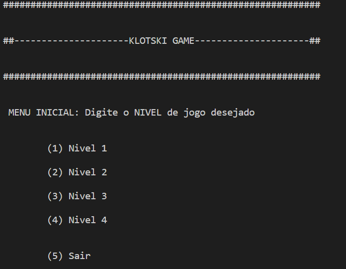
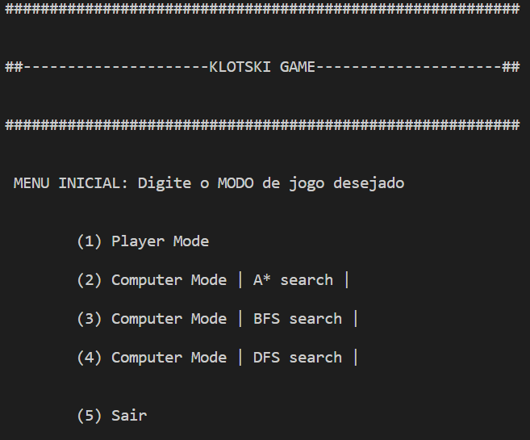

# KLOTSKI GAME

 [Klotski Game](https://en.wikipedia.org/wiki/Klotski) developed for IART Pratical Project using pyhton3

## HOW TO RUN

Run the game using:

    python3 klotski.py

## Game Options

    After you run the program choose the level of difficulty you want:

    

    And then the game mode:

    